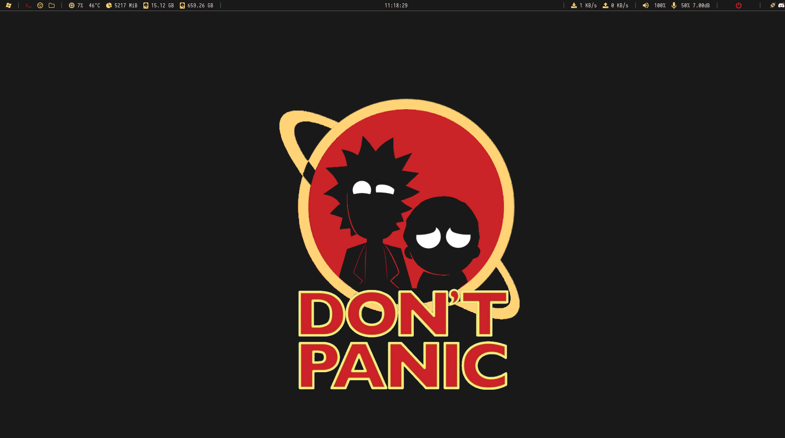

## INFO

- **Distro**: Ubuntu 20.04
- **Window Manager**: i3
- **Bar**: polybar
- **Menu**: rofi
- **Terminal**: alacritty (picom for transparency)
- **File Manager**: ranger/nautilus
- **Shell**: fish
- **Font**: monospace/iosevka
- **Lockscreen**: i3lock

---

## Monitors

- 1920x1080 - 144hz (primary)
- 2160x3840 - 60hz

---

## PREVIEW

