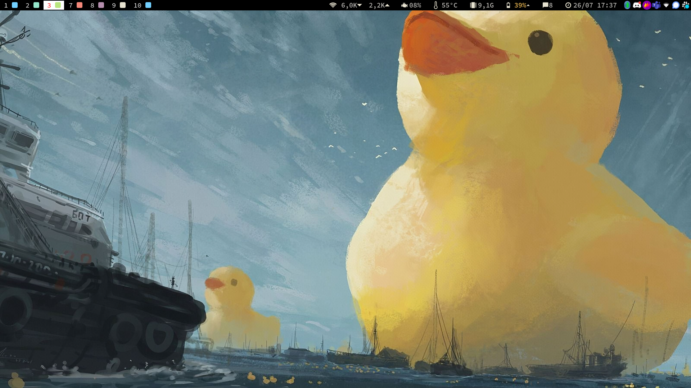
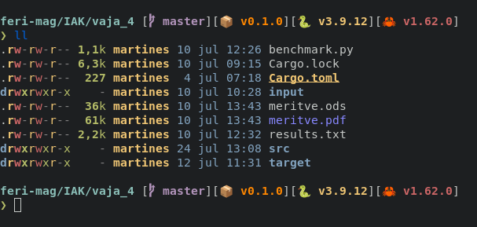

## INFO

- **Distro**: Ubuntu 22.04
- **Desktop Environment**: Regolith 2.0
- **Window Manager**: i3
- **Bar**: i3xrocks
- **Terminal**: alacritty (picom for transparency)
- **Shell**: fish + (starship)[https://starship.rs/]
- **File Manager**: nautilus
- **Node version manager**: fnm

---

## Monitors

- 1920x1080 - 60z (primary)

---

## PREVIEW

