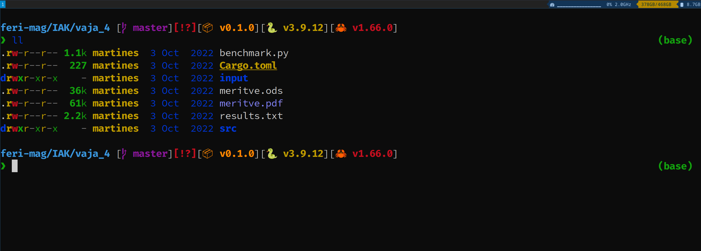

## INFO

- **Distro**: Arch Linux
- **Desktop Environment**: KDE Plasma
- **Window Manager**: i3
- **Bar**: i3status-rust
- **Terminal**: alacritty
- **Shell**: fish + (starship)[https://starship.rs/]
- **File Manager**: dolphin
- **Node version manager**: fnm

---

## Monitors

- 2560x1600 - 60z (primary)
- 3440x1440 - 100hz

---

## PREVIEW

